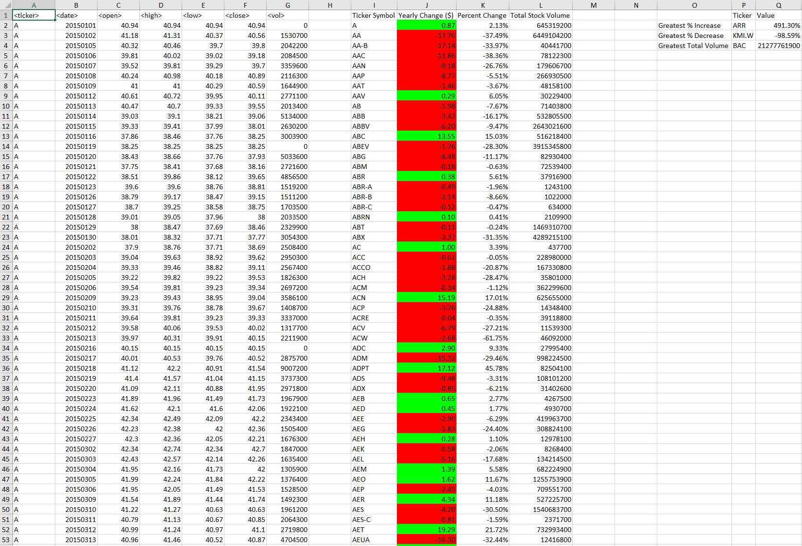

# GT Bootcamp VBA Homework: The VBA of Wall Street

## Table of Contents
1. [Introduction](#introduction)
2. [Objectives](#objectives)
3. [Technologies](#technologies)
4. [Launch](#launch)
5. [Files](#files)
6. [Results](#results)

### Introduction
The purpose of this homework assignment was to create a VBA code to analyze and summarize multiple years of stock data. 

### Objectives
Write a VBA code that:
1. Summarizes each year of stock data by Ticker Symbol with
    * Yearly Change - highlighted to show positive and negative
    * Percent Change
    * Total Stock Volumn
2. Summarizes each year of stock data as a whole with
    * Ticker Symbol & Value of Greatest Percent Increase
    * Ticker Symbol & Value of Greatest Percent Decrease
    * Ticker Symbol & Value of Greatest Total Volume
3. Cycles through all sheets (years) in only one code execution

### Technologies
This project uses: 
* VBA in Excel

### Launch
In order for this project to work you must:
* Ensure your workbook is saved as a file compatible with macros (.xlsm)
* Ensure your data is in the same order and format as provided in columns A-G of the .xlsm files
* Ensure macros are enabled on your excel workbook
* Ensure the developer tab is added to your toolbar
* Paste the code from VBA-Challenge-Code.vb into a new Module in Visual Basic
* Execute the processSheets() Subroutine

### Files
* [alphabetical_testing.xlsm](alphabetical_testing.xlsm): test file used to develop the code
* [Multiple_year_stock_data.xlsm](Multiple_year_stock_data.xlsm): full data file used to generate final homework report
* [VBA-Challenge-Code.bas](VBA-Challenge-Code.bas): file containing the VBA script used to obtain final homework report 

### Results
Below are screenshots of the results for each year
#### 2016 Summary Screenshot

#### 2015 Summary Screenshot

#### 2014 Summary Screenshot
